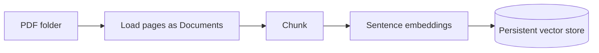
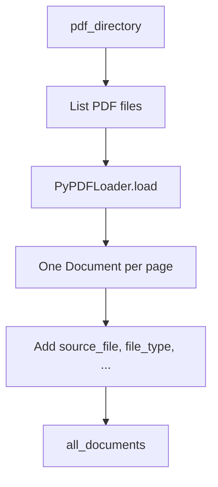
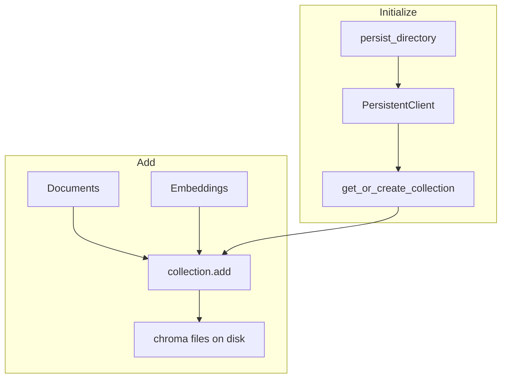
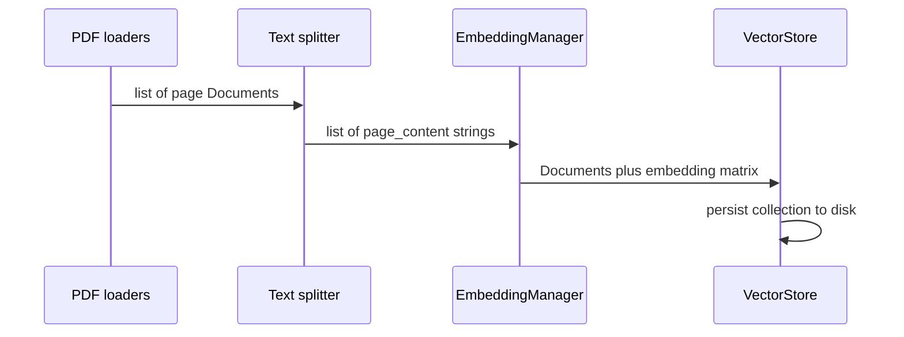

# RAG — Ingestion: PDFs, Chunking, Embeddings, Vector Store

Build the **data ingestion → vector DB** path: load PDFs as `Document`s, split into chunks, embed with an open-source model, persist in Chroma.

Related: [Intro and document structure](rag-intro-document-structure.md).

---

## 1. Where this sits in the pipeline

Loaders already turn files into a **list of `Document`** (`page_content` + `metadata`). Next:



This noteset stops at **vectors on disk**. Retrieval (query embed → similarity search → LLM) is the next pipeline.

---

## 2. Typical imports

```python
import os
from pathlib import Path
from langchain_community.document_loaders import PyPDFLoader, PyMuPDFLoader
from langchain.text_splitter import RecursiveCharacterTextSplitter
```

Later: `sentence_transformers`, `chromadb`, `numpy`, `uuid`, typing helpers, and (for retrieval) cosine similarity from scikit-learn.

Other file types: use other LangChain **document loaders**; the rest of this pipeline stays the same if the output is still `Document`s.

---

## 3. Load all PDFs in a directory

**`process_all_pdfs(pdf_directory)`** (name can vary):

1. Resolve the folder with `Path` (relative to the workspace / notebook cwd).
2. List `*.pdf` (glob / regex).
3. For each file, `PyPDFLoader(str(path)).load()` (or `PyMuPDFLoader`).
4. Enrich **metadata** on each returned document, then append to `all_documents`.

Example metadata keys to add yourself:

| Key | Role |
|-----|------|
| `source_file` | Filename |
| `file_type` | e.g. `"pdf"` |

Loaders already attach fields such as author, dates, `total_pages`, page numbers, `source`. Extra keys are for **filters** after vectors are stored.

**Shape of the result:** a **flat list** of `Document`. PDF loaders typically emit **one document per page**. Example from a demo run: four PDFs → **64** page-documents (15 + 27 + 21 + 1 pages). Your repo may differ (e.g. one large PDF → many pages).



Call with the data folder, e.g. `../data/pdf`.

---

## 4. Chunking

Page-level documents are often **too large** for embedding context limits and for precise retrieval. Split them into overlapping windows.

### 4.1 `split_documents`

Typical defaults:

| Parameter | Example | Meaning |
|-----------|---------|--------|
| `documents` | List of `Document` | Pages from the loader |
| `chunk_size` | `1000` | Max characters per chunk (splitter units, not always tokens) |
| `chunk_overlap` | `200` | Characters shared with the **next** chunk so sentences are not cut off with no context |

### 4.2 `RecursiveCharacterTextSplitter`

Recursively splits on a **separator list**, trying coarse breaks first (paragraphs), then finer ones, until pieces fit `chunk_size`.

```python
text_splitter = RecursiveCharacterTextSplitter(
    chunk_size=1000,
    chunk_overlap=200,
    separators=["\n\n", "\n", " ", ""],
)
chunks = text_splitter.split_documents(documents)
```

| Separator | Typical meaning |
|-----------|-----------------|
| `"\n\n"` | Paragraphs |
| `"\n"` | Lines |
| `" "` | Words |
| `""` | Characters (last resort) |

You can add others (e.g. `","`) later. Other **chunking strategies** (semantic, etc.) come after this basic pipeline.

`split_documents` **copies metadata** onto each chunk and updates `page_content`.

**Example scale:** 64 page-documents → **359** chunks (depends on text length and settings).


Inspect a chunk: first ~200 characters of `page_content` plus `metadata`.

---

## 5. Embeddings — `EmbeddingManager`

Convert **chunk text → vectors** with a Hugging Face **sentence-transformers** model (runs locally; no paid API required).

**Model:** `all-MiniLM-L6-v2`  
**Dimension:** **384** (`get_sentence_embedding_dimension()`).


### 5.1 Constructor

- Store `model_name`.
- `self.model = None` until load.
- Call `_load_model()` from `__init__`.

### 5.2 `_load_model` (protected)

Leading `_` means “internal to the class.” Load:

```python
self.model = SentenceTransformer(self.model_name)
```

Print dimension after load.

### 5.3 `generate_embeddings(texts: List[str]) -> np.ndarray`

```python
return self.model.encode(texts, show_progress_bar=True)
```

Input is a **list of strings**, not `Document`s. Extract text first:

```python
texts = [doc.page_content for doc in chunks]
embeddings = embedding_manager.generate_embeddings(texts)
```

`len(texts)` must match `len(chunks)` and later `len(embeddings)`.

Optional helper: `get_embedding_dimension()` wrapping `self.model.get_sentence_embedding_dimension()` — not required if you already print dimension on load.

**Instantiate:** `embedding_manager = EmbeddingManager()` — constructor loads the model (first run may download weights).

---

## 6. Vector store — `VectorStore` (Chroma)

Store **embeddings + original chunk text + metadata** so you can run **similarity search** later.

Open-source options mentioned: **Chroma**, **FAISS** (CPU). This pipeline uses **Chroma PersistentClient** so the index lives on disk (e.g. `../data/vector_store`).



### 6.1 `__init__`

| Arg | Example | Meaning |
|-----|---------|--------|
| `collection_name` | `"pdf_documents"` | Named bucket of vectors (like a table) |
| `persist_directory` | `"../data/vector_store"` | Folder on disk |

Then `_initialize_store()`.

### 6.2 `_initialize_store`

1. `os.makedirs(persist_directory, exist_ok=True)`
2. `chromadb.PersistentClient(path=persist_directory)`
3. `get_or_create_collection(name=..., metadata={...})`
4. `collection.count()` — **0** on a new collection; **non-zero** if you already ingested

A **collection** is the named set of records (ids, embeddings, documents, metadatas).

### 6.3 `add_documents(documents, embeddings)`

- Require `len(documents) == len(embeddings)`.
- For each `(doc, embedding)`:
  - **id:** `doc_{uuid.hex[:8]}_{i}` — Chroma needs unique IDs; UUID avoids collisions if you ingest again (duplicates are **new rows**, not updates, unless you reuse IDs).
  - **metadata:** copy `doc.metadata`, add `doc_index`, `content_length`.
  - **document:** `doc.page_content`
  - **embedding:** `embedding.tolist()` (NumPy → list)
- `collection.add(ids=..., embeddings=..., metadatas=..., documents=...)`

After a successful add, `count()` should equal the number of chunks (e.g. 359) **for a fresh collection**. Re-running `add` **without** deleting will **increase** the count.

**Instantiate:** `vectorstore = VectorStore()` — creates client + collection only. Nothing is indexed until `add_documents`.

---

## 7. Wiring the pieces

```python
# 1. pages
all_pdf_documents = process_all_pdfs("../data/pdf")

# 2. chunks
chunks = split_documents(all_pdf_documents, chunk_size=1000, chunk_overlap=200)

# 3. embeddings
texts = [doc.page_content for doc in chunks]
embeddings = embedding_manager.generate_embeddings(texts)

# 4. persist
vectorstore.add_documents(chunks, embeddings)
```



Classes exist so **load → split → embed → store** stay separate modules you can swap (different embedder, FAISS instead of Chroma, etc.).

---

## 8. Persistence

After `add_documents`, Chroma writes under `persist_directory` (SQLite plus segment files). Restart the notebook, point `PersistentClient` at the same path, `get_or_create_collection` with the same name, and the vectors are still there — no need to re-embed unless the corpus changed.

---

## 9. What is not in this pipeline yet

- Query embedding and **similarity search** / `collection.query`
- Prompt **augmentation** and LLM **generation**
- Advanced chunkers, paid embedding APIs, metadata filters at query time

Those use the same collection and the **same embedding model** as ingestion.
